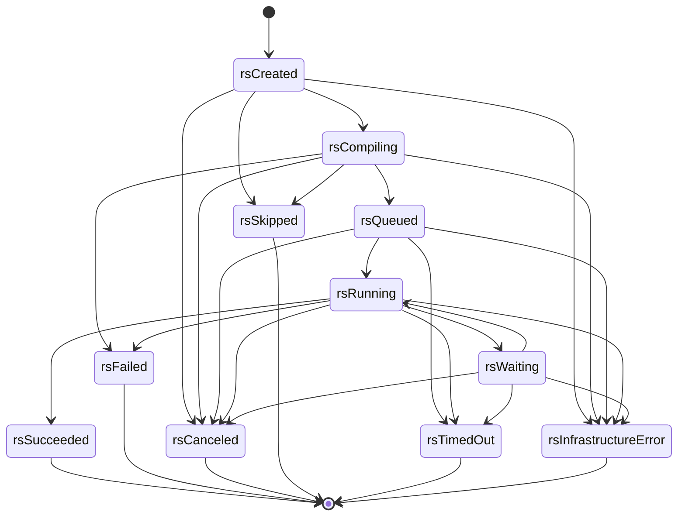
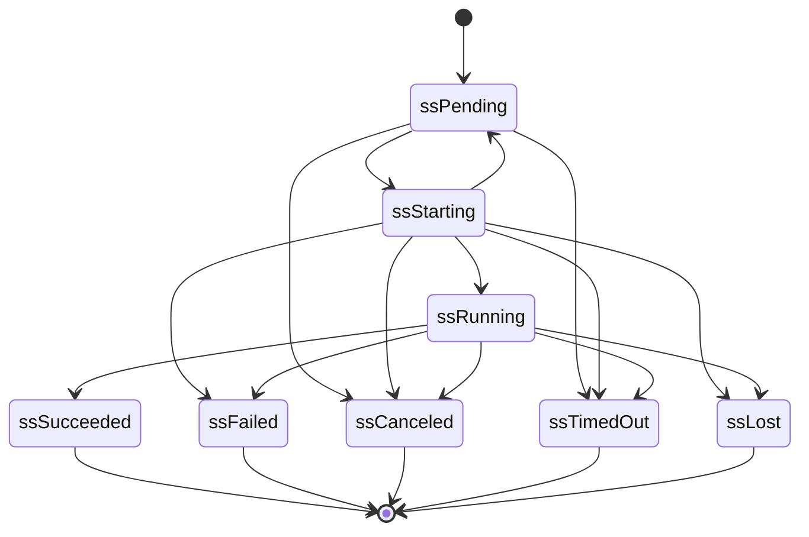
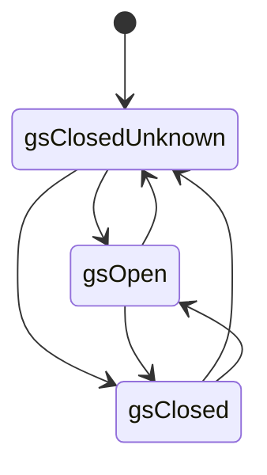
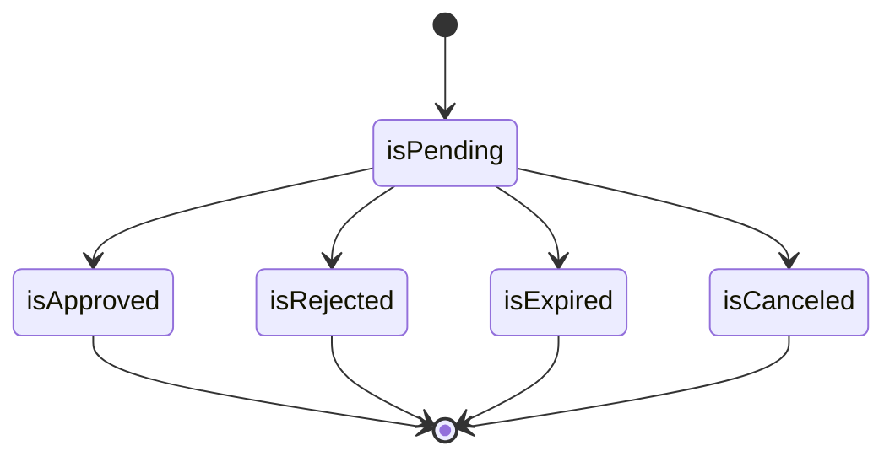

# State machines

Generated from `src/common/states.nim`; do not edit by hand. Tests check that this file is current and that
state names match `proto/cicd/internal/v1/common.proto`.

## Run (RUN-001)

Transitions are compare-and-swap writes in rqlite. Terminal states are final: a retry of a finished run is a new run (PIP-015).

## Step attempt (RUN-001, RUN-002)

`pending` is `queued` in the queue example of 7.2 and `starting` is `dispatched` (ADR 0012). A retry creates a new attempt in `pending`.
`starting -> pending` is allowed only when no Pod exists yet (the launch gate closed before creation, RUN-015).
`lost` means the Pod disappeared without a final status (RUN-002).

## Launch gate (RUN-015)

The gate is closed until the log circuit state is known (also after a scheduler restart) and closes within 10 s of a failure.

## Input / approval (PIP-013)

An input is decided exactly once.

